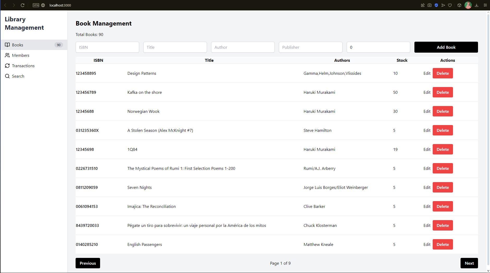

# Manage Library

## Requirements:

1. Librarians must be able to maintain:
   - Books with stock maintained 
   - Members 
   - Transactions

2. The use cases included here are to:
   - Perform general CRUD operations on Books and Members 
   - Issue a book to a member 
   - Issue a book return from a member 
   - Search for a book by name and author 
   - Charge a rent fee on book returns 
   - Make sure a member’s outstanding debt is not more than Rs.500

3. Integration for Data Import 
   - The librarian should be able to import books into the system using the Frappe API and create book records.

## Frontend Image

1. BookComponent

